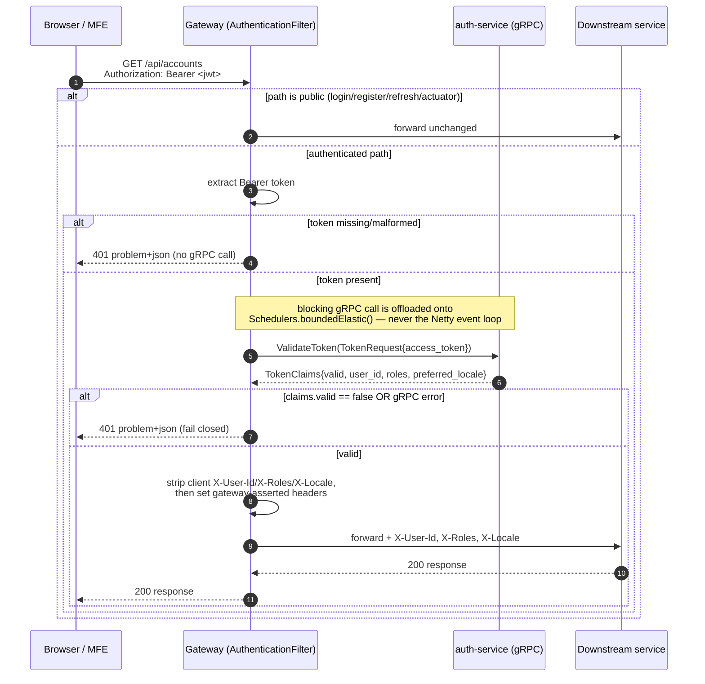

# SecureBank API Gateway — Design

The gateway is the **only publicly reachable backend** in the SecureBank microservices
platform (MICROSERVICES_SPEC §0). Every browser / micro-frontend request enters here,
is authenticated centrally, and is then proxied to the correct internal service.

---

## 1. Routing table

| Public path | HTTP method(s) | Downstream service | local URI | docker URI |
|---|---|---|---|---|
| `/api/auth/**` | all | auth-service | `http://localhost:8081` | `http://auth-service:8081` |
| `/api/accounts/**` | all | account-service | `http://localhost:8082` | `http://account-service:8082` |
| `/api/transactions/**` | all | transaction-service | `http://localhost:8083` | `http://transaction-service:8083` |
| `/api/insights/**`, `/api/assistant/**` | all | fraud-service | `http://localhost:8084` | `http://fraud-service:8084` |

Each route is wrapped in a per-route **CircuitBreaker** filter that forwards to
`/__fallback` (returns RFC-7807 `503`) when the downstream is failing.

### Public vs. authenticated routes

The global authentication filter requires a valid Bearer token on **every** route except:

- `/api/auth/login`, `/api/auth/register`, `/api/auth/refresh` — how a client *obtains* a token.
- `/actuator/**` — health & metrics on the management surface.

---

## 2. The gRPC authentication filter — sequence

For an authenticated request, the gateway calls `AuthService.ValidateToken` over gRPC and,
on success, injects trusted identity headers before proxying.



### Why offload the gRPC call (reactive ⇄ blocking)

Spring Cloud Gateway runs on **Reactor Netty** event-loop threads. Those threads must never
block — blocking one stalls every in-flight request multiplexed on that loop. The generated
gRPC **blocking** stub *does* block (it waits for the network round-trip). We bridge the two
models in `AuthenticationFilter`:

```java
Mono.fromCallable(() -> authClient.validate(token))   // defer the blocking call
    .subscribeOn(Schedulers.boundedElastic())         // run it OFF the event loop
    .flatMap(claims -> ...)                            // back on reactive flow with result
```

- `Mono.fromCallable` turns the blocking invocation into a deferred reactive producer.
- `subscribeOn(boundedElastic())` executes it on an elastic worker pool sized for blocking
  I/O, leaving the Netty loop free. With Java 21 **virtual threads enabled**
  (`spring.threads.virtual.enabled=true`), those workers are cheap.
- An equally valid alternative is the **async/future gRPC stub** wrapped in
  `Mono.fromFuture`; we chose the offloaded blocking stub for simplicity. A per-call gRPC
  **deadline** (1.5 s) bounds the wait either way.

The call **fails closed**: any gRPC error (auth-service down, deadline exceeded) results in
`401`, never an accidental pass-through.

---

## 3. Trusted-header propagation (centralized auth)

After a valid token, the gateway forwards:

| Header | Source | Meaning |
|---|---|---|
| `X-User-Id` | `TokenClaims.user_id` | authenticated principal id |
| `X-Roles` | `TokenClaims.roles` (comma-joined) | authorization roles |
| `X-Locale` | `TokenClaims.preferred_locale` (default `en`) | i18n preference (en/hi/mr) |

**Why centralize:** token verification (JWT signature, expiry) lives in exactly one place.
Downstream services never parse JWTs or share the signing key — they simply trust these
headers because, on the internal cluster network, the gateway is the only thing that can
reach them, and it **strips any client-supplied copies** of these headers first so a caller
can't spoof identity. This is the "validate centrally, propagate a small trusted claims
object" pattern described in `auth.proto` and MICROSERVICES_SPEC §3.

---

## 4. Why a gateway at all?

- **Single public entry point** — only one component is exposed; internal services stay
  cluster-private, shrinking the attack surface.
- **Cross-cutting concerns in one place** — authentication, CORS, rate-limit hooks,
  resilience (circuit breakers/timeouts), and observability are implemented once instead of
  N times across services.
- **Stable public contract** — the `/api/**` surface stays constant even if the internal
  topology (ports, service splits) changes.
- **Protocol translation** — public REST in, internal gRPC for auth.

## 5. Design patterns used

- **API Gateway / Facade** — one façade hides the internal microservice topology and
  presents a single REST surface to the frontends.
- **Filter chain (Chain of Responsibility)** — Spring Cloud Gateway processes each request
  through an ordered chain; `AuthenticationFilter` (a `GlobalFilter`, order `-1`) is one link
  that can short-circuit (401) or enrich (headers) the request.
- **Circuit Breaker** — per-route Resilience4j breakers trip on downstream failure and
  degrade gracefully via the fallback controller.
- **Trusted Subsystem / centralized authentication** — verify once at the edge, propagate
  trusted claims inward.

---

## 6. Configuration & profiles

- `application.yml` — **local** defaults; downstreams on `localhost:8081-8084`,
  auth gRPC on `localhost:9091`.
- `application-docker.yml` — **docker/k8s**; downstreams by service name, auth gRPC on
  `auth-service:9091`; enables k8s health probe groups.

Activate the docker profile with `SPRING_PROFILES_ACTIVE=docker` (the Dockerfile and the
k8s ConfigMap set this).
